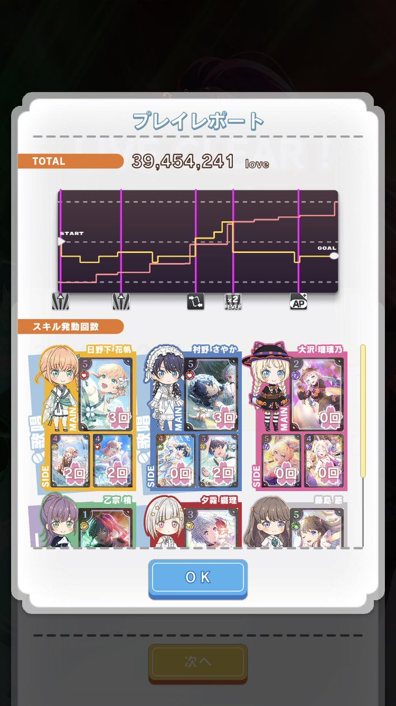
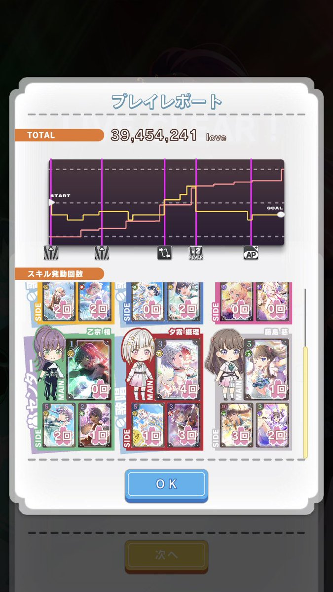
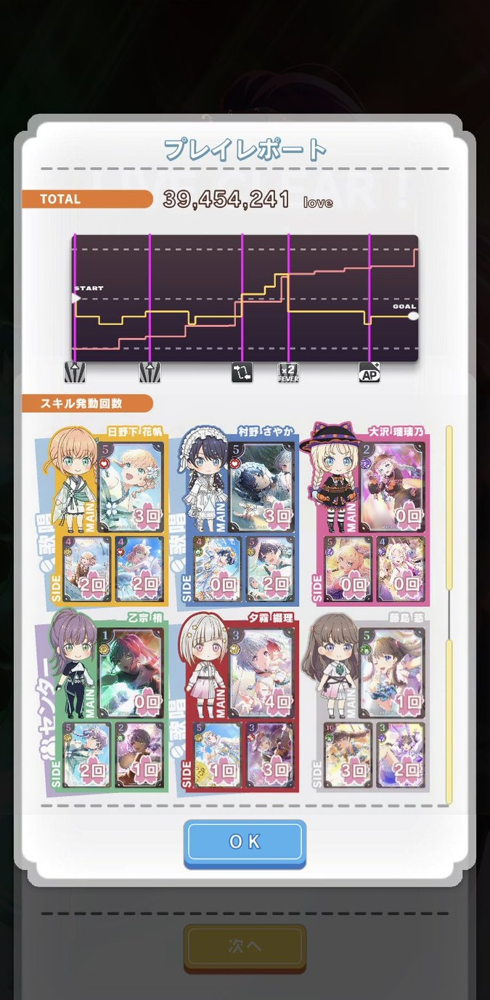

# リンクラのプレイレポートをつなげるやつ

[site link!](https://concat-lll-playreport.web.app/)

## Wawawa☆What's this?

『Link! Like! LoveLive!』通称リンクラのサポートツールです。
スクステのプレイレポートのスキル使用回数の部分が一枚のスクリーンショットに収められず共有がしにくい問題を、2枚のスクリーンショットをつなげて1枚の画像にすることによって解決します。

### example

上の2枚の画像を入力すると

  
  

 
このように綺麗につながった画像が出力されます。

## 仕様
どうやって実現しているのか

### 環境
画像処理はFirebase Functions上のPythonの実行環境でopencvを動かしています。
フロントエンドはベタ書きしたものをFirebase Hostingでホストしています。

### アルゴリズム

